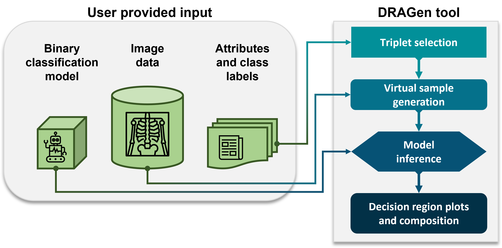

# DRAGen: Decision Region Analysis for Generalizability 

**DRAGen is an AI/ML model agnostic approach to assess generalizability.**

<picture>
  <source media="(max-width: 799px)" srcset="docs/flowchart_vertical.png?" />
  <source media="(min-width: 800px)" srcset="docs/flowchart.png?" />
  
</picture>

<p style="text-align: center;"> Overview of the decision region generation and analysis process  </p>

---

This repository contains the implementation for the methodology in the paper "Decision region analysis for generalizability of artificial intelligence models: estimating model generalizability in the case of cross-reactivity and population shift". The Open Access paper is available at this [link](https://doi.org/10.1117/1.JMI.11.1.014501).

> View more Regulatory Science Tools (RSTs) at [cdrh-rst.fda.gov](https://cdrh-rst.fda.gov/)

## Additional References
- Alexis Burgon, Berkman Sahiner, Nicholas Petrick, Gene Pennello, Kenny H. Cha, Ravi K. Samala, "Decision region analysis for generalizability of artificial intelligence models: estimating model generalizability in the case of cross-reactivity and population shift," J. Med. Imag. 11(1) 014501 (25 January 2024) https://doi.org/10.1117/1.JMI.11.1.014501
- Alexis Burgon, Nicholas Petrick, Berkman Sahiner, Gene Pennello, Ravi K. Samala, "Predicting AI model behavior on unrepresented subgroups: A test-time approach to increase variability in a finite test set", 2023 FDA Science Forum. ([link](https://www.fda.gov/science-research/fda-science-forum/predicting-ai-model-behavior-unrepresented-subgroups-test-time-approach-increase-variability-finite))
- Alexis Burgon, Nicholas Petrick, Berkman Sahiner, Gene Pennello, and Ravi K. Samala "Decision region analysis to deconstruct the subgroup influence on AI/ML predictions", Proc. SPIE 12465, Medical Imaging 2023: Computer-Aided Diagnosis, 124651H (7 April 2023); https://doi.org/10.1117/12.2653963

<!---
# Citation
To cite our work:

    A. Burgon, N. Petrick, B. Sahiner, G. Pennello, R. K. Samala, “Decision region analysis to deconstruct the subgroup influence on AI/ML predictions”, Proc. of SPIE, 12465, 124651H (2023). doi.org/10.1117/12.2653963

## Bibtex citation
```
    @inproceedings{burgon2023decision,
  title={Decision region analysis to deconstruct the subgroup influence on AI/ML predictions},
  author={Burgon, Alexis and Petrick, Nicholas and Sahiner, Berkman and Pennello, Gene and Samala, Ravi K},
  booktitle={Society of Photo-Optical Instrumentation Engineers (SPIE) Conference Series},
  volume={12465},
  pages={124651H},
  year={2023}
}
```
-->
# Introduction
Understanding an artificial intelligence (AI) model's ability to generalize to its target population is critical to ensure the safe and effective use of AI in medical devices. Traditional generalizability assessment relies on the availability of large, diverse data sets, which are difficult to obtain for medical imaging. We present an approach for enhanced generalizability assessment by examining the decision space beyond the available test set.

A vicinal distribution of virtual images is created by linearly interpolating between a sample "triplet" of three images. The composition of the region of the decision space is then approximated from the model inference on the virtual images. Aggregating the decision region compositions from many triplets provides insight into the overall decision region composition. 

# Getting Started
For detailed information, view the [DRAGen documentation](https://didsr.github.io/DRAGen/).

An interactive example of how to use this repository can be found in the [example notebook](https://github.com/DIDSR/RST_Decision_Region_Analysis/blob/main/examples/example_implementation.ipynb).

## Example Output


<p style="text-align: center;">  Example decision region composition plot. The decision region compositions are aggregated based on the class of the sample triplet. </p>

---

## System Requirements
```
python 3.10.6
Ubuntu 22.04.2 LTS
```
Python package requirements can be found in [requirements.txt](requirements.txt).

## Data
The data included in the [examples](examples/) folder were accessed through TCIA:
- Saltz, J., Saltz, M., Prasanna, P., Moffitt, R., Hajagos, J., Bremer, E., Balsamo, J., & Kurc, T. (2021). Stony Brook University COVID-19 Positive Cases [Data set]. The Cancer Imaging Archive. https://doi.org/10.7937/TCIA.BBAG-2923
- Clark K, Vendt B, Smith K, Freymann J, Kirby J, Koppel P, Moore S, Phillips S, Maffitt D, Pringle M, Tarbox L, Prior F. The Cancer Imaging Archive (TCIA): Maintaining and Operating a Public Information Repository, Journal of Digital Imaging, Volume 26, Number 6, December, 2013, pp 1045-1057. DOI: [10.1007/s10278-013-9622-7](https://doi.org/10.1007/s10278-013-9622-7)
  
## Disclaimer
### About the Catalog of Regulatory Science Tools
The enclosed tool is part of the [Catalog of Regulatory Science Tools](https://cdrh-rst.fda.gov/), which provides a peer-reviewed resource for stakeholders to use where standards and qualified Medical Device Development Tools (MDDTs) do not yet exist. These tools do not replace FDA-recognized standards or MDDTs. This catalog collates a variety of regulatory science tools that the FDA's Center for Devices and Radiological Health's (CDRH) Office of Science and Engineering Labs (OSEL) developed. These tools use the most innovative science to support medical device development and patient access to safe and effective medical devices. If you are considering using a tool from this catalog in your marketing submissions, note that these tools have not been qualified as [Medical Device Development Tools](https://www.fda.gov/medical-devices/medical-device-development-tools-mddt) and the FDA has not evaluated the suitability of these tools within any specific context of use. You may [request feedback or meetings for medical device submissions](https://www.fda.gov/regulatory-information/search-fda-guidance-documents/requests-feedback-and-meetings-medical-device-submissions-q-submission-program) as part of the Q-Submission Program.

For more information about the Catalog of Regulatory Science Tools, email [RST_CDRH@fda.hhs.gov](mailto:RST_CDRH@fda.hhs.gov).

### Tool Reference 
- RST Reference Number: RST24AI04.01
- Date of Publication: 09/19/2025
- Recommended Citation: U.S. Food and Drug Administration. (2025).  DRAGen: Decision Region Analysis for Generalizability (RST24AI04.01). [https://cdrh-rst.fda.gov/dragen-decision-region-analysis-generalizability](https://cdrh-rst.fda.gov/dragen-decision-region-analysis-generalizability)
