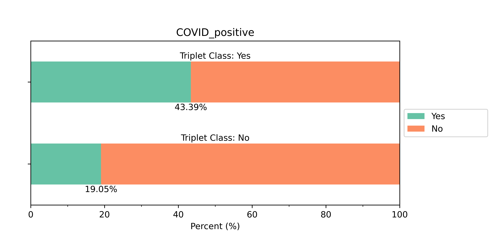

# Decision Region Analysis for Generalizability (DRAGen) of AI models

**DRAGen is an AI/ML model agnostic approach to assess generalizability.**


This repository contains the implementation for the methodology in the paper "Decision region analysis to deconstruct the subgroup influence on ai/ml predictions". The paper is available at this [link](https://www.spiedigitallibrary.org/conference-proceedings-of-spie/12465/124651H/Decision-region-analysis-to-deconstruct-the-subgroup-influence-on-AI/10.1117/12.2653963.short).

## Additional References
- [FDA Science Forum Poster](https://www.fda.gov/science-research/fda-science-forum/predicting-ai-model-behavior-unrepresented-subgroups-test-time-approach-increase-variability-finite)

# Citation
To cite our work:

    A. Burgon, N. Petrick, G. Berkman Sahiner, et al., “Decision region analysis to deconstruct the subgroup influence on ai/ml predictions,” in Proc. of SPIE Vol, 12465, 124651H–1 (2023).

## Bibtex citation
```
    @inproceedings{burgon2023decision,
  title={Decision region analysis to deconstruct the subgroup influence on AI/ML predictions},
  author={Burgon, Alexis and Petrick, Nicholas and Sahiner, Berkman and Pennello, Gene and Samala, Ravi K},
  booktitle={Society of Photo-Optical Instrumentation Engineers (SPIE) Conference Series},
  volume={12465},
  pages={124651H},
  year={2023}
}
```
# Introduction
Understanding an artificial intelligence (AI) model's ability to generalize to its target population is critical to ensure the safe and effective use of AI in medical devices. Traditional generalizability assessment relies on the availability of large, diverse data sets, which are difficult to obtain for medical imaging. We present an approach for enhanced generalizability assessment by examining the decision space beyond the available test set.

A vicinal distribution of virtual images is created by linearly interpolating between a sample "triplet" of three images. The composition of the region of the decision space is then approximated from the model inference on the virtual images. Aggregating the decision region compositions from many triplets provides insight into the overall decision region composition. 

# Getting Started
The documentation for this project is included in the [docs/build/html](https://github.com/DIDSR/RST_Decision_Region_Analysis/tree/main/docs/build/html) folder. To view the documentation, download a copy of this folder and open the file ``index.html``. 

An interactive example of how to use this repository can be found in the [example notebook](https://github.com/DIDSR/RST_Decision_Region_Analysis/blob/main/examples/example_implementation.ipynb)

## Example Output


## System Requirements
```
python 3.10.6
Ubuntu 22.04.2 LTS
```
Python package requirements can be found in [requirements.txt](requirements.txt).